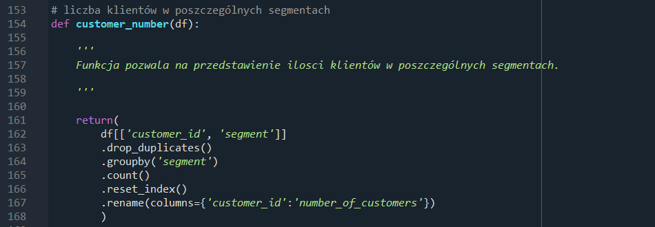
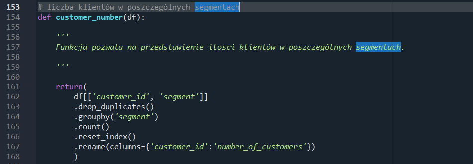
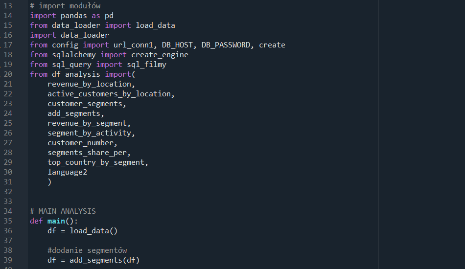

# DVD_Pandas_SQL

Autor: Kamila Dudzińska 

Automatyczny system pobierający dane z bazy danych PostgreSQL, wykonujący analizę danych i przygotowujący raport podsumowujacy w excelu.

Program:
*  łaczy się z bazą danych dvd_rental z postgres SQL
*  za pomocą zoptymalizowanych kwerend pobierane są dane
*  w pliku df anaysis znajdują się funkcje z dokładnym opisem, które posłużą do analizy danych
*  w main wykonywana jest analiza danych wraz z podsumowaniem
*  na koniec generowany jest plik excel z wieloma zakładkami, w którym uzyskamy odpowiednio zagregowne/policzone/przedstawione dane 

Technologie: 
*  Języki: Python, SQL
*  biblioteki: pandas, SQLAlchemy, Openpyxl, aata_loader, dotenv, psycopg2-binary
*  baza danych: PostgreSQL

Struktura projektu:
src/
* config.py           # Konfiguracja bazy i zmiennych środowiskowych
* sql_query.py        # Zapytanie SQL
* analysis.py         # logika analizy i funkcje z docstringami
* main.py             # Główny skrypt sterujący

Output: Plik Excel z zakładkami

Konfiguracja ze zmiennymi środowiskowymi w celu zachowania bezpieczeństwa:

Funkcje:

Główny skrypt analizy:

###  Kontakt:

